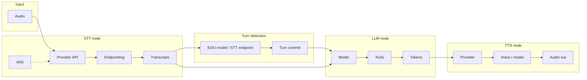

# Scalability and multi-tenant (interview prep §3)

**Purpose:** Prep for “How would you support many clients?” and “How would you make the system more flexible?”  
**Link:** `docs/interview-prep-real-time-voice-ai.md` §3.

**Scope:** We focus on **complex customization**—custom logic in turn detection, transcript processing, and interruption handling—not just plug/unplug models.

---

## Key points (memorize)

- **Per-tenant config:** Different clients need different languages, models, or compliance → drive config from **metadata** (job/room/participant), not hardcoding.
- **Customizing a pipeline:** Two levels—**simple** (plug/unplug models per tenant) and **complex** (custom logic in nodes: turn detection, transcript post-processing, interruption handling). **We focus on complex.**
- **One-sentence answer:** "At scale you need per-tenant configuration and pluggable pipeline stages, not one global config."

---

## Learning: Pipeline structure and customization

The voice agent pipeline has three main nodes: **STT → LLM → TTS**. Each node is built from smaller components with practical knobs. LiveKit uses **wrappers** for deeper customization—wrap a plugin to add logging, rules, or per-tenant logic without rewriting the pipeline.

### How it works

Audio flows into **STT**, which streams partial and final transcripts. **Turn detection** (VAD + EOU model or STT endpointing) decides when the user has finished speaking. Once the turn commits, the **LLM** receives the transcript, generates a reply (optionally using tools), and streams text to **TTS**, which produces audio. Wrappers can sit around any node to add custom behavior.

### Pipeline flow (STT → LLM → TTS + components)

### Components and practical knobs

| Node | Components | Practical knobs |
|------|------------|-----------------|
| **STT** | Provider/API, endpointing, language, VAD, interim vs final | `model`, `language`, `interim_results`, `endpointing`, `utterance_end_ms`, `extra_kwargs`; VAD: `min_silence_duration`, `activation_threshold`; wrapper: transcript post-processing (PII, filler removal) |
| **LLM** | Model, system prompt, tools, streaming, context | `model`, instructions, tool definitions, context window; wrapper: prompt injection, tool filtering |
| **TTS** | Provider, model, voice, language, streaming | `model`, `voice_id`, `language`; wrapper: post-processing, prosody |
| **Turn detection** | VAD, EOU model, STT endpointing, manual | `turn_detection` (`"multilingual"`, `"vad"`, `"stt"`, `"manual"`); wrapper: custom turn detector (logging, rule blending, thresholds) |
| **Interruptions** | VAD-driven barge-in | `min_interruption_duration`, `min_interruption_words`, `allow_interruptions` |

### Detailed breakdown by node

| Node | Sub-components | Knobs / wrappers |
|------|----------------|------------------|
| **STT** | Provider (Deepgram, AssemblyAI, Speechmatics), model (nova-3, flux), language, endpointing (when to finalize phrases), interim vs final transcripts, VAD (silence/speech detection) | `model`, `language`, `interim_results`, `endpointing`, `utterance_end_ms`, `extra_kwargs`; Silero VAD: `min_silence_duration`, `activation_threshold`; **wrapper:** stt_node override for PII redaction, filler removal, keyword detection |
| **LLM** | Model (gpt-4o-mini, gpt-4o), system prompt, tools / function calling, streaming, context window | `model`, instructions, tool definitions, context; **wrapper:** prompt injection, tool filtering, custom chat formatting |
| **TTS** | Provider (ElevenLabs, OpenAI), model (turbo vs flash), voice_id, language, streaming | `model`, `voice_id`, `language`; **wrapper:** audio post-processing, prosody control |
| **Turn detection** (cross-node) | VAD (speech vs silence), EOU model (MultilingualModel), STT endpointing (Flux/AssemblyAI), manual | `turn_detection` = `"multilingual"` \| `"vad"` \| `"stt"` \| `"manual"`; **wrapper:** CustomTurnDetector for logging, rule blending (hesitation/filler), per-tenant thresholds |

---

## Current state in this project

- **Single effective tenant:** STT, LLM, and TTS are chosen once in the **entrypoint** from **env vars** (e.g. `ELEVEN_TTS_MODEL`, and hardcoded voice_id / model names).
- **Pipeline is already pluggable:** We build `deepgram.STT(...)`, `openai.LLM(...)`, `elevenlabs.TTS(...)` and pass them into `AgentSession(...)`. So the *shape* is right—we just don’t vary it per caller.
- **No tenant identity yet:** We use `ctx.room.sid` or `ctx.job_id` for `session_id`; there’s a comment “Extract from room metadata if available” for `user_id`, but we don’t read tenant/language/model from **room or job metadata**.

So: the pipeline is stage-based and injectable; what’s missing is **reading tenant (or room/job) metadata and building STT/LLM/TTS from that**.

---

## Target: what “multi-tenant” means here

1. **Per-tenant (or per-room) config:** Each job/room can specify (e.g. via LiveKit room metadata or job metadata):
   - **Language** (e.g. `es`, `en`) → STT language, TTS language, and agent instructions.
   - **Models:** STT model (e.g. nova-3 vs flux), LLM model (e.g. gpt-4o-mini vs gpt-4o), TTS model (e.g. eleven_turbo_v2_5 vs eleven_flash_v2_5) and voice_id.
   - **Tenant id** (optional) for logging, rate limits, or compliance.
2. **Single codebase:** The same `entrypoint` runs for all clients; it **reads metadata → builds the right STT/LLM/TTS → starts the session**. No separate app per tenant.
3. **Pluggable stages:** We don’t rewrite the pipeline; we **choose or override** each stage (STT, LLM, TTS) from config.
4. **Complex customization (our focus):** Per-tenant or per-session **custom logic** in turn detection (custom EOU, turn detector wrapper), transcript processing (`stt_node` override), and interruption handling—not just swapping models.

---

## Implementation plan (“how we’re gonna do that”)

### Phase 1: Metadata and config shape (no new dependencies)

1. **Define where config lives:** Use LiveKit **room metadata** (or **job metadata** if the dispatcher sends it) as the source of truth for this session. Example shape (JSON in metadata):
   - `language`: e.g. `"es"` (default from env or app default).
   - `stt_model`, `stt_language`: e.g. `"nova-3"`, `"multi"` or `"es"`.
   - `llm_model`: e.g. `"gpt-4o-mini"` or `"gpt-4o"`.
   - `tts_model`, `tts_voice_id`, `tts_language`: e.g. `"eleven_turbo_v2_5"`, `"86V9x9hrQds83qf7zaGn"`, `"es"`.
   - Optional: `tenant_id` for observability/billing.

2. **Read metadata in the entrypoint:** In `agent.py` `entrypoint(ctx)`:
   - Get `ctx.room.metadata` (and optionally job metadata if you use it).
   - Parse JSON (with safe defaults) into a small **session config** dict or dataclass (language, stt_*, llm_*, tts_*, tenant_id).
   - If metadata is missing or invalid, fall back to **current behavior** (env + hardcoded defaults).

3. **Keep observability:** Pass `tenant_id` or `session_id` (and optionally config snapshot) into your existing `ObservabilityContext` so logs/traces are per-tenant when present.

### Phase 2: Build pipeline from config

4. **STT:** Construct `deepgram.STT(model=config["stt_model"], language=config["stt_language"])` from session config (with env fallbacks for API keys).

5. **LLM:** Construct `openai.LLM(model=config["llm_model"])` from session config.

6. **TTS:** Construct `elevenlabs.TTS(model=config["tts_model"], voice_id=config["tts_voice_id"], language=config["tts_language"])` from session config (again with env fallbacks).

7. **Agent instructions:** Optionally vary system prompt / greeting by `config["language"]` (e.g. Spanish vs English) so the same agent code serves both.

8. **No global config:** Remove (or demote) env vars that today *override* model/voice; env becomes **defaults or secrets only** (e.g. API keys, default language). Per-session behavior comes from metadata.

### Phase 3 (optional): Pluggable overrides — simple

9. **Pre/post hooks (simple):** If a tenant needs custom STT (e.g. PII redaction) or custom TTS post-processing, add a thin wrapper around the STT/TTS instance for that tenant. Pipeline shape stays STT → LLM → TTS; only the implementation of a stage changes.

10. **Multiple providers:** Allow metadata to choose provider (e.g. `stt_provider: "deepgram"` vs `"assemblyai"`) and have a small factory that returns the right STT/LLM/TTS implementation.

### Phase 4 (primary focus): Complex STT / turn detection customization

**Scope:** Custom logic for turn detection, transcript processing, and interruption handling—not just parameter tweaks. This is where we focus. Hands-on: `docs/hands-on-turn-detection-interruptions.md`.

| Path | What it adds | Use case |
|------|--------------|----------|
| **Custom turn detector wrapper** | Wrap `MultilingualModel`; add logging, RPC, custom thresholds, rule blending | EOU observability, per-tenant EOU tuning, research |
| **Override `stt_node`** | Post-process `SpeechEvent`s (transcripts, start/end of speech) | Keyword detection, filler removal, PII redaction, domain normalization |
| **Custom EOU model** | Implement `predict_end_of_turn(chat_ctx) -> float` with your own logic | Rule-based or heuristic EOU; blend with MultilingualModel |
| **Manual turn control** | `turn_detection="manual"`; use `commit_user_turn()`, `clear_user_turn()`, `interrupt()` | Push-to-talk; fully custom turn logic |
| **STT endpointing** | `turn_detection="stt"`; use provider’s phrase endpointing (AssemblyAI, Deepgram Flux) | Different EOU strategy; keep VAD for barge-in |

11. **Per-tenant turn config:** Metadata could select `turn_detection: "multilingual" | "vad" | "stt" | "manual"` and optionally custom turn detector instance or stt_node override for that tenant.

---

## Custom turn detector: rule blending (implemented)

**Rule: hesitation/filler** — If the last word of the user transcript is a filler word (eh, este, mmm, um, uh, pues, etc.) and the base EOU probability is &lt; 0.7, we reduce the returned probability by 50% so the agent waits longer instead of cutting the user off.

**Filler words (Spanish + universal):** eh, este, mmm, um, uh, ehh, pues, em, ah, o, sea

**Code:** `CustomTurnDetector._blend_hesitation()` in `agent-server/agent.py`

---

## Experiments: turn detection + rule blending

**Run with:** `DEBUG=true python agent.py console` (same script: greet → say one of the phrases below)

**Baseline:** "El menú, por favor."

| # | Phrase | What to notice |
|---|--------|----------------|
| 1 | "El menú, por favor." | Baseline; EOU should rise after "por favor." |
| 2 | "El menú... [pause 2–3 s] ...por favor." | Pause in middle; EOU should stay low during pause, rise after "por favor." |
| 3 | "Por favoooor, el menú." | Stretched; EOU behavior. |
| 4 | "El menú." | Very short; EOU should rise quickly. |
| 5 | "Me gustaría ver el menú por favor." | Longer; EOU should rise after "por favor." |
| 6 | **"Eh... el menú por favor."** | **Hesitation/filler rule:** EOU after "eh" should be lower (we blend down); full phrase should still commit. |
| 7 | **"Este... este... el menú."** | **Hesitation/filler rule:** Multiple fillers; EOU after each "este" should stay low; commit after "el menú." |

**Logs to compare:** `eou_probability` events; look for lower values when last word is filler (runs 6, 7) vs when it isn't (runs 1, 4).

### Results (runs 1–7)

| Run | Phrase | Transcript(s) | EOU | Notes |
|-----|--------|---------------|-----|-------|
| 1 | "El menú, por favor." | "El menú, por favor." | 0.87 | Baseline; single transcript; turn committed. |
| 2 | "El menú... [pause] ...por favor." | "El menú" → "por favor." | 0.02 → 0.91 | First partial low; agent waited during pause; second partial high, turn committed. |
| 3 | "Por favoooor, el menú." | "Por favor," → "el menú." | 0.01 → 0.18 | Stretched; first partial low; turn committed after first; second partial 0.18. |
| 4 | "El menú." | "El menú." | 0.04 | Very short; EOU low; turn committed. |
| 5 | "Me gustaría ver el menú por favor." | "Buenas tardes... Me gustaría ver el menú, por favor." | 0.69 | Longer; single transcript; EOU below 0.7; turn committed. |
| 6 | "Eh... el menú por favor." | "El menú, por favor." | 0.90 | Filler may be dropped by STT; EOU high; turn committed. |
| 7 | **"Este... este... el menú."** | "Este," → "este," → "el menú." | **0.0007 → 0.0045 → 0.037** | **Filler rule:** EOU very low after each "este"; commit after "el menú." |

### Analysis

**Multilingual EOU model behavior**
- Complete utterances ending in "por favor" or "el menú." → EOU 0.69–0.91 (runs 1, 2, 5, 6).
- Incomplete or fragment-like text → EOU 0.01–0.04 (runs 2 partial, 3, 4, 7 partials).
- Longer phrases can stay below 0.7 (run 5: 0.69) but still commit; the commit threshold appears to be lower or there is timeout/other logic.

**Pause and partial transcripts (runs 2, 3)**
- Run 2: After "el menú" EOU 0.02 → agent waits → after "por favor" EOU 0.91 → turn commits. Pause handling behaves as intended.
- Run 3: Stretched delivery yields separate STT chunks; first "por favor" gets EOU 0.01; turn commits on that first partial, so the agent responds to "por favor" alone. Stretched speech increases risk of early commit on incomplete phrases.

**Short utterances (runs 4, 5)**
- "El menú." with EOU 0.04 still commits; likely due to timeout or short-utterance handling.
- Confirms that low EOU alone does not block commits; there is other commit logic.

**Hesitation/filler rule (runs 6, 7)**
- Run 7: "Este... este... el menú." — EOU 0.0007 and 0.0045 after each "este"; agent waits; after "el menú" EOU 0.037, turn commits. Rule blending keeps EOU low when the last word is filler.
- Run 6: "Eh" was likely dropped by STT; transcript is "El menú, por favor." so no filler in text and no blend. Rule blending only applies when fillers appear in the transcript.

**Takeaways**
1. EOU model correctly distinguishes complete vs incomplete turns in most cases.
2. Rule blending works when fillers are present in the transcript; STT may drop very short fillers.
3. Commit logic includes more than raw EOU (e.g. timeouts, short phrases).
4. Stretched speech can produce partial transcripts that trigger early commits; production tuning may need STT endpointing or longer wait times.

---

## Rehearsal notes

- **How I’d support many clients:** “I’d drive config from room or job metadata—language, STT/LLM/TTS model, voice, optional tenant_id. The entrypoint would read that and build the right pipeline per session. Same codebase; no hardcoded per-tenant branches. Env vars only for defaults and API keys.”
- **How I’d make the system more flexible (we focus on complex):** “Simple layer: config selects STT/LLM/TTS per tenant from metadata. Complex layer—where we focus—override nodes: custom turn detector wrapper (EOU observability, rule blending), stt_node override (transcript post-processing, keyword detection), custom EOU model, manual turn control, or STT endpointing. That’s real logic, not just parameter tweaks. Same pipeline shape; deeper customization when clients need better turn detection or transcript handling.”

### Likely questions — short answers

- **“How would you support many clients?”**  
  “Per-tenant config from metadata—room or job—so each client can have their own language, models, and voice. We build STT, LLM, and TTS from that config in the entrypoint. One codebase; observability and billing keyed by tenant when present.”

- **“How would you make the system more flexible?”**  
  “We focus on complex customization. Override nodes—custom turn detector wrapper (EOU observability, rule blending), stt_node for transcript post-processing (keyword detection, filler removal), custom EOU model, manual turn control, or STT endpointing. That’s real logic in turn detection and transcript handling, not just plug/unplug. Simple layer: config selects models per tenant from metadata.”
